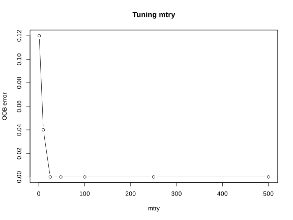
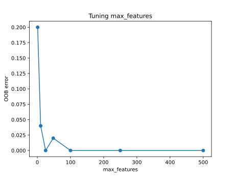

# Exercises

## Before you start

These exercises use the Small Round Blue Cell Tumors (SRBCT) dataset. It contains the expression level of 2308 genes measured on 63 tumor biopsies. Each sample belongs to one of four childhood tumor types that are notoriously hard to tell apart under a microscope: Burkitt Lymphoma (BL), Ewing Sarcoma (EWS), neuroblastoma (NB) and rhabdomyosarcoma (RMS). We will train a random forest that distinguishes the four types from gene expression alone, and then ask which genes drive that distinction, both overall and for one tumor type in particular.

**Choose either R or Python and follow that language for the entire chapter.** Both tracks answer the same questions on the same 63 samples and 2308 genes, but R and Python use different random number generators, so the exact train and test samples, the tuned `mtry`, and the exact ranking of genes you find can differ slightly between the two. That is expected and does not change the conclusions.

The six exercises are **sequential**. Each one names the objects it creates, and later exercises reuse those exact objects. Work through them in order, in one R session or one Python session, and keep every named object until the end of Exercise 6.

## Getting the data

Download the file here: [srbct.csv](data/srbct.csv){download="srbct.csv"}, and place it in a `data` folder next to your script or notebook, so the path below works unchanged.

```text
your-project/
├── analysis.R          # or analysis.py / analysis.ipynb
└── data/
    └── srbct.csv
```

`srbct.csv` has 63 rows, one per tumor sample, and 2309 columns:

- 2308 gene expression predictors, named `g1` to `g2308`. These are continuous values with no missing data.
- `class`, the tumor type label. This is the outcome we want to predict, and it has four levels: `BL`, `EWS`, `NB` and `RMS`.

There is no sample identifier column and no column that is for plotting only. Every column except `class` is a predictor.

## Packages

::: panel-tabset
## R

```{r eval=FALSE}
install.packages("randomForest")
```

## Python

``` bash
python -m pip install pandas scikit-learn matplotlib
```
:::

The solutions below were produced with R 4.5.3 and `randomForest` 4.7.1.2, and with Python 3.13.13, `scikit-learn` 1.9.1, `pandas` 3.0.6, `numpy` 2.5.3 and `matplotlib` 3.11.2. Later package versions may give slightly different numbers.

## Setup

Run this once, at the start of your session. It reads the data and separates the predictors from the outcome.

::: panel-tabset
## R

```{r eval=FALSE}
srbct_data <- read.csv("data/srbct.csv", check.names = FALSE)

x <- srbct_data[, setdiff(names(srbct_data), "class")]
y <- factor(srbct_data$class)
```

## Python

```{python eval=FALSE}
import pandas as pd

srbct_data = pd.read_csv("data/srbct.csv")

X = srbct_data.drop(columns=["class"])
y = srbct_data["class"]
```
:::

## Exercise 1. Inspect the data and create a stratified split

Before fitting anything, we always set aside part of the data and never look at it again until the model is finished. This held out test set is what lets us check, honestly and only once, how well the model works on samples it has never seen. Everything we do before that point, including fitting the model and choosing its settings, must use only the remaining training data.

With only 63 samples spread across four classes, and only 8 samples in the smallest class, an ordinary random split could easily leave a class with very few, or even zero, test samples. A stratified split takes the training and test samples separately within each class, so every class keeps roughly the same proportion in both sets.

**Task**

1. Confirm that `x`/`X` has 63 rows and 2308 columns, and that it contains no missing values.
2. Report how many samples belong to each of the four classes.
3. Create a stratified 80 percent training and 20 percent test split, using seed `1`. Store the result as `x_train`, `y_train`, `x_test` and `y_test` (R) or `X_train`, `y_train`, `X_test` and `y_test` (Python).
4. Verify that the class counts in the training and test sets add up to the original class counts, and that no sample appears in both sets.

::: callout-tip
## Tip

In R, `split()` groups row indices by class so that you can sample separately within each group. In Python, `train_test_split` does this for you directly through its `stratify` argument. Keep all four objects from this exercise. They are reused in every exercise that follows.
:::

::::: {.callout-note collapse="true"}
## Solution

::: panel-tabset
## R

```{r eval=FALSE}
dim(x)
anyNA(x)
table(y)

set.seed(1)
train_id <- unlist(lapply(split(seq_len(nrow(x)), y), function(idx) {
  sample(idx, size = round(0.8 * length(idx)))
}))
train_id <- sort(train_id)
test_id <- setdiff(seq_len(nrow(x)), train_id)

x_train <- x[train_id, ]
y_train <- y[train_id]
x_test  <- x[test_id, ]
y_test  <- y[test_id]

rbind(train = table(y_train), test = table(y_test))
length(train_id) + length(test_id) == nrow(x)
length(intersect(train_id, test_id))
```
```
[1] 63 2308
[1] FALSE

BL EWS  NB RMS
 8  23  12  20

      BL EWS NB RMS
train  6  18 10  16
test   2   5  2   4
[1] TRUE
[1] 0
```

## Python

```{python eval=FALSE}
from sklearn.model_selection import train_test_split

print(X.shape)
print(X.isna().any().any())
print(y.value_counts())

X_train, X_test, y_train, y_test = train_test_split(
    X, y, test_size=0.2, stratify=y, random_state=1
)

print(pd.DataFrame({"train": y_train.value_counts(), "test": y_test.value_counts()}))
print(len(X_train) + len(X_test) == len(X))
```
```
(63, 2308)
False

class
EWS    23
RMS    20
NB     12
BL      8
Name: count, dtype: int64

       train  test
class
EWS       18     5
RMS       16     4
NB        10     2
BL         6     2
True
```
:::

Even with stratification, the test set is tiny, only 13 samples, and the smallest class (BL) has just 2 of them. A single misclassified sample later will move the test accuracy by several percentage points, so keep that in mind when you interpret results in the next exercises.
:::::

## Exercise 2. Fit a first random forest

Continue with `x_train`/`X_train` and `y_train` from Exercise 1.

A random forest grows many decision trees, each one on its own bootstrap sample of the training data, a random sample taken with replacement. Because of that, any single tree only ever sees around two thirds of the training samples on average. Predicting the remaining ones, the out-of-bag (OOB) samples, with the trees that never saw them gives a built-in estimate of error, without needing a separate validation set.

At every split, each tree is also only allowed to choose from a random subset of the genes, rather than all 2308 of them. The size of that subset is a setting called `mtry` in R and `max_features` in Python. Let's start with the smallest possible value, `mtry = 1`, so that only a single random gene is available at every split, and see how the forest performs.

**Task**

Fit a random forest on the training data with `mtry = 1` and `ntree = 500`. Store it as `rf_baseline`, and report its OOB error rate.

::: callout-tip
## Tip

A fitted `randomForest` object in R stores its OOB predictions directly in `fit$predicted`. In Python, pass `oob_score=True` when creating the `RandomForestClassifier`, and read the error off `1 - rf.oob_score_` after fitting.
:::

::::: {.callout-note collapse="true"}
## Solution

::: panel-tabset
## R

```{r eval=FALSE}
set.seed(1)
rf_baseline <- randomForest::randomForest(x_train, y_train, mtry = 1, ntree = 500)
rf_baseline
```
```

Call:
 randomForest(x = x_train, y = y_train, ntree = 500, mtry = 1)
               Type of random forest: classification
                     Number of trees: 500
No. of variables tried at each split: 1

        OOB estimate of  error rate: 12%
Confusion matrix:
    BL EWS NB RMS class.error
BL   5   1  0   0  0.17
EWS  0  17  0   1  0.06
NB   0   1  9   0  0.10
RMS  0   3  0  13  0.19
```

## Python

```{python eval=FALSE}
from sklearn.ensemble import RandomForestClassifier

rf_baseline = RandomForestClassifier(n_estimators=500, max_features=1,
                                      oob_score=True, random_state=1)
rf_baseline.fit(X_train, y_train)
print(f"OOB estimate of error rate: {1 - rf_baseline.oob_score_:.1%}")
```
```
OOB estimate of error rate: 20.0%
```
:::

With only one random gene available at every split, the OOB error rate is quite high, 12 percent in R and 20 percent in Python. Each tree has so little information to work with that many of its splits are weak, and averaging 500 such trees only partly makes up for that. Let's see next whether a larger `mtry` does better.
:::::

## Exercise 3. Tune `mtry` using out-of-bag error

Continue with `x_train`/`X_train` and `y_train` from Exercise 1. Do not use the test set in this exercise.

`mtry` is a hyperparameter, a setting we choose before fitting the forest rather than something the algorithm learns by itself. Exercise 2 showed that a small `mtry` can hurt performance, so it is worth trying a range of values and keeping the one that does best. Because OOB error already gives us an honest performance estimate without touching the test set, it is a convenient tool for comparing hyperparameter settings, not only for checking one final model.

**Task**

1. For each value of `mtry` in `1, 10, 25, 48, 100, 250, 500`, fit a random forest on the training data with 500 trees, and record its OOB error rate. The default `mtry` for classification is the square root of the number of predictors, which here is about 48, so this range covers the default as well as values well below and above it.
2. Plot OOB error against `mtry`.
3. Store the `mtry` with the lowest OOB error as `best_mtry`.

::: callout-tip
## Tip

Fit every candidate model on the training set only, exactly as in Exercise 2. The value `mtry = 1` should reproduce the OOB error you already found for `rf_baseline`.
:::

::::: {.callout-note collapse="true"}
## Solution

::: panel-tabset
## R

```{r eval=FALSE}
mtry_grid <- c(1, 10, 25, 48, 100, 250, 500)
oob_error <- numeric(length(mtry_grid))

for (i in seq_along(mtry_grid)) {
  set.seed(1)
  fit <- randomForest::randomForest(x_train, y_train, mtry = mtry_grid[i], ntree = 500)
  oob_error[i] <- mean(fit$predicted != y_train)
}

tune_result <- data.frame(mtry = mtry_grid, oob_error = oob_error)
tune_result

plot(tune_result$mtry, tune_result$oob_error, type = "b",
     xlab = "mtry", ylab = "OOB error", main = "Tuning mtry")

best_mtry <- tune_result$mtry[which.min(tune_result$oob_error)]
best_mtry
```
```
  mtry oob_error
1    1      0.12
2   10      0.04
3   25      0.00
4   48      0.00
5  100      0.00
6  250      0.00
7  500      0.00

[1] 25
```



## Python

```{python eval=FALSE}
import matplotlib.pyplot as plt

mtry_grid = [1, 10, 25, 48, 100, 250, 500]
oob_errors = []

for mf in mtry_grid:
    rf = RandomForestClassifier(n_estimators=500, max_features=mf,
                                 oob_score=True, random_state=1)
    rf.fit(X_train, y_train)
    oob_errors.append(1 - rf.oob_score_)

tune_result = pd.DataFrame({"mtry": mtry_grid, "oob_error": oob_errors})
print(tune_result)

plt.plot(tune_result["mtry"], tune_result["oob_error"], marker="o")
plt.xlabel("max_features")
plt.ylabel("OOB error")
plt.title("Tuning max_features")
plt.show()

best_mtry = int(tune_result.loc[tune_result["oob_error"].idxmin(), "mtry"])
best_mtry
```
```
   mtry  oob_error
0     1       0.20
1    10       0.04
2    25       0.00
3    48       0.02
4   100       0.00
5   250       0.00
6   500       0.00

25
```


:::

Moving `mtry` away from 1 brings a large and immediate improvement, and OOB error then stays low across a wide range of larger values, including the default of 48. With this many genes and this few samples, the classes are already easy to separate once `mtry` is large enough, so several values reach, or come close to, 0 percent OOB error. In this situation it makes sense to keep the smallest `mtry` among the best performing ones, `25`, rather than the largest. A smaller `mtry` keeps the trees more different from one another, which is the whole point of the random part of a random forest, and it is cheaper to compute. `best_mtry` is used to fit the final model in the next exercise.
:::::

## Exercise 4. Fit the final model and evaluate it on the test set

Continue with `x_train`/`X_train`, `y_train`, `x_test`/`X_test`, `y_test` and `best_mtry` from the previous exercises.

So far, every number we have looked at came from OOB error, computed internally from the training data. It is now time to check performance on the test set we set aside in Exercise 1 and have not touched since. This is the one honest, unbiased look we get at how the model handles samples it was never trained on, which is why it is important not to use it earlier, for example to help choose `mtry`.

**Task**

1. Fit a random forest on the training data using `best_mtry` and 500 trees, with importance scores enabled. Store it as `rf_model`. Report its OOB error rate and OOB confusion matrix.
2. Use `rf_model` to predict the test set. Report the confusion matrix and the overall accuracy. In a confusion matrix, rows and columns represent predicted and true classes, and a perfect model would have every sample on the diagonal, where predicted and true class agree.
3. Compare the OOB error from step 1 with the test error from step 2, and decide whether the OOB estimate was a reasonable preview of test performance here.

::: callout-tip
## Tip

This is the first and only time you touch `y_test` in this chapter. Everything before this exercise, including the choice of `best_mtry`, was decided using the training data alone.
:::

::::: {.callout-note collapse="true"}
## Solution

::: panel-tabset
## R

```{r eval=FALSE}
set.seed(1)
rf_model <- randomForest::randomForest(x_train, y_train, mtry = best_mtry,
                                        ntree = 500, importance = TRUE)
rf_model

pred_test <- predict(rf_model, x_test)
table(predicted = pred_test, true = y_test)
mean(pred_test == y_test)
```
```

Call:
 randomForest(x = x_train, y = y_train, ntree = 500, mtry = best_mtry,      importance = TRUE)
               Type of random forest: classification
                     Number of trees: 500
No. of variables tried at each split: 25

        OOB estimate of  error rate: 2%
Confusion matrix:
    BL EWS NB RMS class.error
BL   6   0  0   0         0.0
EWS  0  18  0   0         0.0
NB   0   0  9   1         0.1
RMS  0   0  0  16         0.0

         true
predicted BL EWS NB RMS
      BL   2   0  0   0
      EWS  0   5  0   0
      NB   0   0  2   0
      RMS  0   0  0   4
[1] 1
```

## Python

```{python eval=FALSE}
from sklearn.metrics import confusion_matrix, accuracy_score

rf_model = RandomForestClassifier(n_estimators=500, max_features=best_mtry,
                                   oob_score=True, random_state=1)
rf_model.fit(X_train, y_train)
print(f"OOB estimate of error rate: {1 - rf_model.oob_score_:.1%}")

pred_test = rf_model.predict(X_test)
print(pd.DataFrame(confusion_matrix(y_test, pred_test, labels=rf_model.classes_),
                    index=rf_model.classes_, columns=rf_model.classes_))
print(accuracy_score(y_test, pred_test))
```
```
OOB estimate of error rate: 0.0%
     BL  EWS  NB  RMS
BL    2    0   0    0
EWS   0    5   0    0
NB    0    0   2    0
RMS   0    0   0    4
1.0
```
:::

Both tracks classify every test sample correctly. The OOB error from the training data, around 0 to 2 percent, was already a good preview of this, which is exactly the point of using OOB error instead of a separate validation set when samples are scarce. At the same time, a perfect score on 13 test samples, one tumor type represented by only 2 of them, should not be read as proof that this model works on any new SRBCT sample. It shows that these particular genes separate these particular tumor types very cleanly in this dataset, which is a well known property of this classic benchmark.
:::::

## Exercise 5. Find the genes that matter most overall

Continue with `rf_model` from Exercise 4.

Once a forest fits well, a natural next question is which predictors it actually relies on, since with 2308 genes and only a handful that likely matter, finding them is often more useful than the classifier itself. The most direct way to measure this is to take one gene at a time, randomly shuffle its values across the test samples so that it no longer carries real information, and see how much the model's performance drops. A gene the model depends on heavily will hurt performance a lot when scrambled like this, while a gene it barely uses will hardly matter. Averaged over many repeats, this gives each gene a score called the mean decrease in accuracy.

**Task**

1. For every gene, estimate how much the model's performance drops when that gene is randomly shuffled.
2. Report the 10 genes with the largest mean decrease in accuracy. Store them as `top10_overall`.

::: callout-tip
## Tip

R's `randomForest::importance()` computes the mean decrease in accuracy for you directly, as one of its columns, since it already permutes each OOB sample internally while the forest is being trained.

`scikit-learn` has no equivalent built into the model itself. Use `sklearn.inspection.permutation_importance` on the test set instead, which does the shuffling and re-scoring for you. Running it on all 2308 genes is slow and mostly wasted, since only a handful are likely to matter. Narrow down to a shortlist of 100 candidate genes first, using the forest's fast, built-in impurity score (`feature_importances_`), refit a forest on just that shortlist, and run the permutation importance only there. Because the model already classifies the test set almost perfectly, measure the drop in the model's confidence for the correct class rather than a plain right or wrong count, since a confidence score keeps changing even once the predictions themselves stop flipping.
:::

::::: {.callout-note collapse="true"}
## Solution

::: panel-tabset
## R

```{r eval=FALSE}
imp <- randomForest::importance(rf_model)
top10_overall <- rownames(imp)[order(imp[, "MeanDecreaseAccuracy"], decreasing = TRUE)][1:10]
round(imp[top10_overall, "MeanDecreaseAccuracy"], 2)
```
```
g1389 g1645 g2146 g1003 g2050  g246  g129 g1954 g2046 g1706
 3.76  3.70  3.65  3.08  2.91  2.90  2.82  2.73  2.70  2.69
```

## Python

```{python eval=FALSE}
import numpy as np
from sklearn.inspection import permutation_importance

def true_class_confidence(estimator, X, y):
    # Average predicted probability assigned to each sample's true class.
    proba = estimator.predict_proba(X)
    class_index = {c: i for i, c in enumerate(estimator.classes_)}
    true_idx = [class_index[label] for label in y]
    return proba[np.arange(len(y)), true_idx].mean()

# Permuting all 2308 genes is too slow, so narrow down to a shortlist first
# using the forest's fast, built-in impurity-based score.
quick_screen = pd.Series(rf_model.feature_importances_, index=X_train.columns)
candidate_genes = quick_screen.sort_values(ascending=False).head(100).index.tolist()

rf_candidates = RandomForestClassifier(n_estimators=500, random_state=1)
rf_candidates.fit(X_train[candidate_genes], y_train)

perm_overall = permutation_importance(rf_candidates, X_test[candidate_genes], y_test,
                                       scoring=true_class_confidence,
                                       n_repeats=20, random_state=1, n_jobs=-1)
importance_all = pd.Series(perm_overall.importances_mean, index=candidate_genes)
top10_overall = importance_all.sort_values(ascending=False).head(10)
top10_overall.round(4)
```
```
g1003    0.0338
g1389    0.0326
g246     0.0322
g2050    0.0294
g545     0.0284
g1954    0.0234
g509     0.0203
g1955    0.0196
g187     0.0137
g1194    0.0132
```
:::

R computes the mean decrease in accuracy from the out-of-bag samples seen during training, while here it is computed by shuffling genes in the held out test set afterwards, so some difference between the two lists is expected on top of the usual difference from training on different splits. They still overlap substantially (`g1389`, `g1003`, `g2050`, `g246` and `g1954` appear in both), and more importantly they tell the same story, a handful of genes carry most of the discriminative signal while the remaining few thousand contribute very little. This is typical of small sample, high dimensional gene expression data.
:::::

## Exercise 6. Find the genes that matter most for Ewing sarcoma specifically

Continue with `rf_model` from Exercise 4 and, for Python, with `rf_candidates` and `candidate_genes` from Exercise 5.

A gene that matters overall is not necessarily the gene that distinguishes one particular tumor type from the rest. The mean decrease in accuracy can also be computed one class at a time, by checking how much the model's performance on that class specifically drops when a gene is shuffled, instead of averaging the drop across all four classes together.

**Task**

Find the 10 genes with the largest mean decrease in accuracy for the EWS class specifically, and store them as `top10_ews`.

::: callout-tip
## Tip

In R, `randomForest::importance()` already returns one column per class alongside the overall `MeanDecreaseAccuracy` column. Pick the `EWS` column directly.

In Python, reuse `rf_candidates` and `candidate_genes` from Exercise 5 rather than refitting, and write a scoring function for `permutation_importance` that only looks at the model's confidence for the samples that are truly EWS, instead of for all test samples.
:::

::::: {.callout-note collapse="true"}
## Solution

::: panel-tabset
## R

```{r eval=FALSE}
imp <- randomForest::importance(rf_model)
top10_ews <- rownames(imp)[order(imp[, "EWS"], decreasing = TRUE)][1:10]
round(imp[top10_ews, "EWS"], 2)
```
```
g1645 g1389 g2050 g1954  g246 g1706 g1319  g368  g188 g1708
 3.77  3.73  3.06  2.96  2.95  2.75  2.72  2.56  2.52  2.48
```

## Python

```{python eval=FALSE}
def ews_confidence(estimator, X, y):
    # Average predicted probability of the EWS class, among samples that are
    # truly EWS.
    proba = estimator.predict_proba(X)
    ews_col = list(estimator.classes_).index("EWS")
    is_ews = (y == "EWS").to_numpy()
    return proba[is_ews, ews_col].mean()

perm_ews = permutation_importance(rf_candidates, X_test[candidate_genes], y_test,
                                   scoring=ews_confidence, n_repeats=20,
                                   random_state=1, n_jobs=-1)
importance_ews = pd.Series(perm_ews.importances_mean, index=candidate_genes)
top10_ews = importance_ews.sort_values(ascending=False).head(10)
top10_ews.round(4)
```
```
g246     0.0495
g1389    0.0479
g545     0.0452
g2050    0.0439
g1954    0.0343
g1003    0.0187
g566     0.0147
g1708    0.0129
g1319    0.0120
g1645    0.0117
```
:::

Most genes on this EWS-specific list already appeared in the overall top 10 from Exercise 5, which makes sense since EWS is the largest class and therefore has a big influence on the overall score too. A few genes stand out here that were not in the overall list at all, for example `g1319` and `g1708` in R, or `g566` and `g1319` in Python. These are genes whose main contribution is telling EWS apart from the other three types specifically, even if they are not among the most useful genes for the classification problem as a whole. This is the kind of finding you would take forward as a candidate for further validation, not as a confirmed biological result on its own.
:::::
