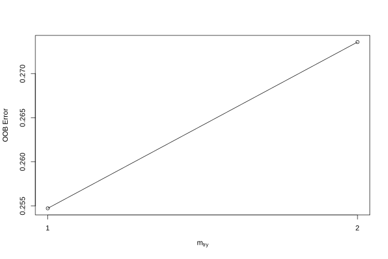
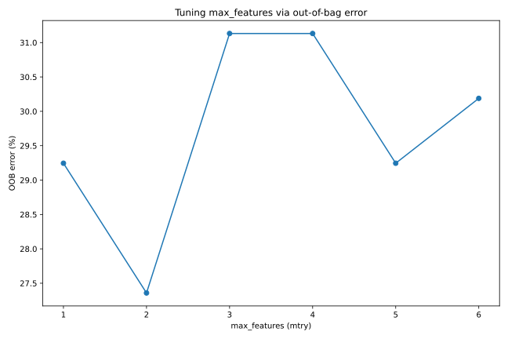
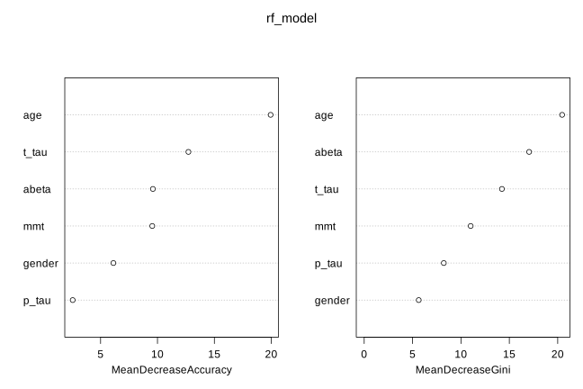
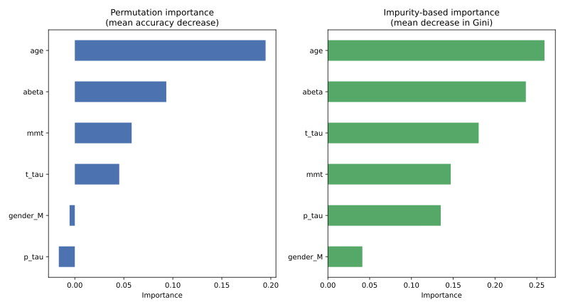

# How to use random forest

There are many packages for fitting random forests. In R, we have been using the `randomForest` package, which does a decent job and is fast enough for most applications; `ranger` is a faster alternative worth checking out. In Python, the standard choice is `RandomForestClassifier` (or `RandomForestRegressor` for regression) from `scikit-learn`.

In this chapter we go through a full modelling workflow in both languages, side by side, using the same Alzheimer's/FTD/MCI dataset as before. The R and Python examples answer the same questions and use the same random forest algorithm underneath, but R and Python use different random-number generators, so the exact numbers differ a little between the two tracks. That is expected and does not change the interpretation.

The Python examples use `pandas` for data handling, `scikit-learn` for modelling, and `matplotlib` for plotting:

::: panel-tabset
## R

```{r eval=FALSE}
install.packages("randomForest")
install.packages("caret")
```

## Python

``` bash
python -m pip install pandas scikit-learn matplotlib
```
:::

The results below were produced with R 4.5.3, `randomForest` 4.7.1.2 and `caret` 7.0.1, and with Python 3.13.13, `scikit-learn` 1.9.1, `pandas` 3.0.6, `numpy` 2.5.3 and `matplotlib` 3.11.2. Later package versions may give slightly different numbers.

## Data

We use the same clinical dataset described in the Prerequisites chapter: 206 samples with age, gender and four CSF measurements (`mmt`, `abeta`, `t_tau`, `p_tau`), labelled with a diagnostic group. Download the file here: [data.csv](data/data.csv){download="data.csv"}, and place it in a `data` folder next to your script or notebook.

We first read the file and recode the `non-demented controls` label to `control`:

::: panel-tabset
## R

```{r eval=FALSE}
data <- read.csv("data/data.csv", sep = ";", stringsAsFactors = FALSE, check.names = FALSE,
                  colClasses = c("numeric","character","numeric","numeric","numeric","numeric","numeric","character"))
data <- data[, -1]
data$group[data$group == "non-demented controls"] <- "control"

head(data)
```
```
  gender age mmt abeta t_tau p_tau group
1      M  75  12   370   240    44    AD
2      F  76  29   390   680   118    AD
3      F  75  26   230   520   106    AD
4      F  82  26   230   530    84    AD
5      F  88  25   460   960   129    AD
6      F  72  25   350   840   118    AD
```

## Python

```{python eval=FALSE}
import pandas as pd

data = pd.read_csv("data/data.csv", sep=";")
data = data.drop(columns=data.columns[0])
data["group"] = data["group"].replace("non-demented controls", "control")

data.head()
```
```
  gender  age  mmt  abeta  t_tau  p_tau group
0      M   75   12    370    240     44    AD
1      F   76   29    390    680    118    AD
2      F   75   26    230    520    106    AD
3      F   82   26    230    530     84    AD
4      F   88   25    460    960    129    AD
5      F   72   25    350    840    118    AD
```
:::

Our data has to be in a data frame where features are in the columns and samples are in the rows. In R, categorical variables should preferably be `factor` and you can keep the response variable as a column in the same data frame, using the `formula` interface (`group ~ .`) to fit the model. In Python, `scikit-learn` instead expects a numeric feature matrix `X` and a separate target vector `y`; categorical predictors such as `gender` first need to be converted into numeric dummy columns, for example with `pandas.get_dummies`.

::: panel-tabset
## R

```{r eval=FALSE}
set.seed(20)
testing_index <- sample(1:length(data$p_tau), 100, replace = FALSE)

limited_data4_training <- data[-testing_index, ]
limited_data4_testing  <- data[testing_index, ]

limited_data4_training$group  <- as.factor(limited_data4_training$group)
limited_data4_training$gender <- as.factor(limited_data4_training$gender)

limited_data4_testing$group  <- as.factor(limited_data4_testing$group)
limited_data4_testing$gender <- as.factor(limited_data4_testing$gender)

head(limited_data4_training)
```
```
   gender age mmt abeta t_tau p_tau group
1       M  75  12   370   240    44    AD
4       F  82  26   230   530    84    AD
7       M  70  25   270   230    34    AD
9       F  68  27   160   810   100    AD
11      M  77  23   430   780   119    AD
12      F  80  26   350  1150   159    AD
```

## Python

```{python eval=FALSE}
from sklearn.model_selection import train_test_split

X = pd.get_dummies(data.drop(columns=["group"]), columns=["gender"], drop_first=True)
y = data["group"].astype("category")

X_train, X_test, y_train, y_test = train_test_split(
    X, y, test_size=100, random_state=20
)

pd.concat([X_train, y_train], axis=1).head()
```
```
     age  mmt  abeta   t_tau  p_tau  gender_M                group
2     75   26  230.0   520.0  106.0     False                   AD
69    80   22  349.0  1250.0  110.0      True                   AD
74    68   24  321.0   303.0   46.0      True                   AD
50    79   30  466.0   546.0   66.0      True                   AD
117   63   26  650.0   130.0   24.0     False  MCI/non-ADConverter
```
:::

## Fitting a random forest model

You can set various parameters in `randomForest`/`RandomForestClassifier`, but probably the most relevant ones are `mtry`/`max_features`, `ntree`/`n_estimators` and `importance`. We have already covered what these parameters do. Printing the fitted R model shows the out-of-bag (OOB) error rate and confusion matrix directly. `scikit-learn` does not print this automatically, but the same information is available from `oob_decision_function_` when `oob_score=True` is set, so we build an equivalent summary ourselves.

::: panel-tabset
## R

```{r eval=FALSE}
rf_model <- randomForest::randomForest(group ~ ., data = limited_data4_training,
                                        ntree = 100, importance = TRUE)
print(rf_model)
```
```

Call:
 randomForest(formula = group ~ ., data = limited_data4_training,      ntree = 100, importance = T)
               Type of random forest: classification
                     Number of trees: 100
No. of variables tried at each split: 2

        OOB estimate of  error rate: 28.3%
Confusion matrix:
                    AD control FTD MCI/ADConverter MCI/non-ADConverter
AD                  36       2   0               0                   2
control              4      23   0               0                   1
FTD                  1       0   0               0                   4
MCI/ADConverter      9       1   0               0                   1
MCI/non-ADConverter  3       2   0               0                  17
                    class.error
AD                    0.1000000
control               0.1785714
FTD                   1.0000000
MCI/ADConverter       1.0000000
MCI/non-ADConverter   0.2272727
```

## Python

```{python eval=FALSE}
import numpy as np
from sklearn.ensemble import RandomForestClassifier
from sklearn.metrics import confusion_matrix

rf_model = RandomForestClassifier(n_estimators=100, oob_score=True, random_state=20)
rf_model.fit(X_train, y_train)

# out-of-bag predictions: the Python equivalent of R's print(rf_model)
oob_pred = rf_model.classes_[np.argmax(rf_model.oob_decision_function_, axis=1)]
oob_error = (oob_pred != y_train.to_numpy()).mean()

print(f"Number of trees: {rf_model.n_estimators}")
print(f"max_features (mtry): {rf_model.max_features}")
print(f"OOB estimate of error rate: {oob_error:.1%}")

oob_cm = pd.DataFrame(confusion_matrix(y_train, oob_pred, labels=rf_model.classes_),
                       index=rf_model.classes_, columns=rf_model.classes_)
oob_cm["class.error"] = 1 - np.diag(oob_cm) / oob_cm.sum(axis=1)
print(oob_cm)
```
```
Number of trees: 100
max_features (mtry): sqrt
OOB estimate of error rate: 28.3%
                     AD  FTD  MCI/ADConverter  MCI/non-ADConverter  control  class.error
AD                   35    2                2                    1        3     0.186047
FTD                   1    0                0                    3        0     1.000000
MCI/ADConverter       6    1                3                    1        0     0.727273
MCI/non-ADConverter   3    1                0                   20        0     0.166667
control               4    0                1                    1       18     0.250000
```
:::

## Predicting new data

For doing prediction, we use `predict`. In R, `predict()` takes `object`, `newdata` and `type`, where `type` is one of `response`, `prob.` or `votes`, giving predicted values, class probabilities or vote counts respectively. `scikit-learn` splits this into separate methods: `predict()` for class labels and `predict_proba()` for class probabilities.

::: panel-tabset
## R

```{r eval=FALSE}
predicted_class <- predict(rf_model, limited_data4_testing, type = "response")
head(predicted_class)
```
```
                166                 191                 107                 120
            control             control             control MCI/non-ADConverter
                130                  98
MCI/non-ADConverter                  AD
Levels: AD control FTD MCI/ADConverter MCI/non-ADConverter
```

## Python

```{python eval=FALSE}
predicted_class = rf_model.predict(X_test)
pd.Series(predicted_class, index=X_test.index).head()
```
```
5                       AD
44         MCI/ADConverter
147                control
130    MCI/non-ADConverter
181                control
```
:::

## Evaluating performance

We can use the `confusionMatrix` function from the `caret` package to calculate accuracy measures: `caret::confusionMatrix(predicted_class, true_class)`. `scikit-learn` has `confusion_matrix` and `classification_report`, but they do not report exactly the same statistics as `caret`, so here we write a small helper that reproduces `caret`'s per-class sensitivity, specificity, predictive values and balanced accuracy from a `scikit-learn` confusion matrix.

::: panel-tabset
## R

```{r eval=FALSE}
caret::confusionMatrix(predicted_class, limited_data4_testing$group)
```
```
Confusion Matrix and Statistics

                     Reference
Prediction            AD control FTD MCI/ADConverter MCI/non-ADConverter
  AD                  30       1   0               9                   3
  control              0      16   0               0                   6
  FTD                  0       0   3               0                   0
  MCI/ADConverter      2       0   0               0                   0
  MCI/non-ADConverter  4       0   3               1                  22

Overall Statistics

               Accuracy : 0.71
                 95% CI : (0.6107, 0.7964)
    No Information Rate : 0.36
    P-Value [Acc > NIR] : 1.203e-12

                  Kappa : 0.5921

 Mcnemar's Test P-Value : NA

Statistics by Class:

                     Class: AD Class: control Class: FTD Class: MCI/ADConverter
Sensitivity             0.8333         0.9412     0.5000                 0.0000
Specificity             0.7969         0.9277     1.0000                 0.9778
Pos Pred Value          0.6977         0.7273     1.0000                 0.0000
Neg Pred Value          0.8947         0.9872     0.9691                 0.8980
Prevalence              0.3600         0.1700     0.0600                 0.1000
Detection Rate          0.3000         0.1600     0.0300                 0.0000
Detection Prevalence    0.4300         0.2200     0.0300                 0.0200
Balanced Accuracy       0.8151         0.9344     0.7500                 0.4889
                     Class: MCI/non-ADConverter
Sensitivity                              0.7097
Specificity                              0.8841
Pos Pred Value                           0.7333
Neg Pred Value                           0.8714
Prevalence                               0.3100
Detection Rate                           0.2200
Detection Prevalence                     0.3000
Balanced Accuracy                        0.7969
```

## Python

```{python eval=FALSE}
def confusion_stats(y_true, y_pred, labels):
    y_true, y_pred = np.asarray(y_true), np.asarray(y_pred)
    cm = confusion_matrix(y_true, y_pred, labels=labels)
    n = cm.sum()
    accuracy = np.trace(cm) / n

    rows = []
    for i, lab in enumerate(labels):
        tp = cm[i, i]
        fn = cm[i, :].sum() - tp
        fp = cm[:, i].sum() - tp
        tn = n - tp - fn - fp
        sensitivity = tp / (tp + fn)
        specificity = tn / (tn + fp)
        rows.append([
            sensitivity, specificity,
            tp / (tp + fp),                       # Pos Pred Value
            tn / (tn + fn),                       # Neg Pred Value
            (tp + fn) / n,                        # Prevalence
            tp / n,                                # Detection Rate
            (tp + fp) / n,                         # Detection Prevalence
            np.mean([sensitivity, specificity]),   # Balanced Accuracy
        ])

    stats = pd.DataFrame(
        rows, index=labels,
        columns=["Sensitivity", "Specificity", "Pos Pred Value", "Neg Pred Value",
                 "Prevalence", "Detection Rate", "Detection Prevalence", "Balanced Accuracy"],
    ).T
    return accuracy, stats

accuracy, stats = confusion_stats(y_test, predicted_class, rf_model.classes_)
print(f"Overall Accuracy: {accuracy:.4f}")
print(stats.round(4))
```
```
Overall Accuracy: 0.7100
                          AD     FTD  MCI/ADConverter  MCI/non-ADConverter  control
Sensitivity           0.8485  0.0000           0.1000               0.7931   0.9048
Specificity           0.7910  0.9892           0.9667               0.8732   0.9747
Pos Pred Value        0.6667  0.0000           0.2500               0.7188   0.9048
Neg Pred Value        0.9138  0.9293           0.9062               0.9118   0.9747
Prevalence            0.3300  0.0700           0.1000               0.2900   0.2100
Detection Rate        0.2800  0.0000           0.0100               0.2300   0.1900
Detection Prevalence  0.4200  0.0100           0.0400               0.3200   0.2100
Balanced Accuracy     0.8198  0.4946           0.5333               0.8332   0.9397
```
:::

## Tuning parameters

To tune `mtry`, R's `randomForest` provides `tuneRF`, which uses out-of-bag error and a left/right search starting from `mtryStart`. `scikit-learn` has no direct equivalent, so in Python we simply loop over candidate `max_features` values, refit the model with `oob_score=True` for each one, and pick the value with the lowest OOB error. This is conceptually the same idea as `tuneRF`, just spelled out explicitly.

::: panel-tabset
## R

```{r eval=FALSE}
par(mfrow = c(1, 1))
set.seed(5)
randomForest::tuneRF(
  limited_data4_training[, setdiff(names(limited_data4_training), "group")],
  limited_data4_training$group,
  mtryStart = 1
)
```
```
mtry = 1  OOB error = 25.47%
Searching left ...
Searching right ...
mtry = 2 	OOB error = 27.36%

      mtry  OOBError
1.OOB    1 0.2547170
2.OOB    2 0.2735849
```



## Python

```{python eval=FALSE}
import matplotlib.pyplot as plt

max_features_values = list(range(1, X_train.shape[1] + 1))
oob_errors = []
for mf in max_features_values:
    m = RandomForestClassifier(n_estimators=100, max_features=mf,
                                oob_score=True, random_state=5)
    m.fit(X_train, y_train)
    pred = m.classes_[np.argmax(m.oob_decision_function_, axis=1)]
    oob_errors.append((pred != y_train.to_numpy()).mean())
    print(f"max_features = {mf}   OOB error = {oob_errors[-1]:.2%}")

best_mf = max_features_values[int(np.argmin(oob_errors))]
print(f"Best max_features (lowest OOB error): {best_mf}")

plt.plot(max_features_values, [e * 100 for e in oob_errors], marker="o")
plt.xlabel("max_features (mtry)")
plt.ylabel("OOB error (%)")
plt.savefig("images/rf-tunerf-py.svg")
```
```
max_features = 1   OOB error = 29.25%
max_features = 2   OOB error = 27.36%
max_features = 3   OOB error = 31.13%
max_features = 4   OOB error = 31.13%
max_features = 5   OOB error = 29.25%
max_features = 6   OOB error = 30.19%

Best max_features (lowest OOB error): 2
```


:::

## Variable importance

Finally, to see the variable importance, R's `importance`/`varImpPlot` extract and plot it directly from the fitted model. `scikit-learn`'s `RandomForestClassifier` exposes impurity-based importance through `feature_importances_`, which corresponds to R's `MeanDecreaseGini`. The permutation-based measure (`MeanDecreaseAccuracy` in R) is not built into the classifier itself; it is computed separately with `sklearn.inspection.permutation_importance`, which we run on the held-out test set here.

::: panel-tabset
## R

```{r eval=FALSE}
randomForest::importance(rf_model)
randomForest::varImpPlot(rf_model)
```
```
              AD   control        FTD MCI/ADConverter MCI/non-ADConverter
gender 0.2606584  4.118921  5.8516194      -0.2829469            2.632055
age    5.4417838 21.579161  1.5053292       3.7648161            7.118233
mmt    5.7195419  7.764001 -0.2705999       1.0383546            3.816802
abeta  5.6091130  3.494602 -1.3176872      -0.3068971            9.856776
t_tau  7.2440944  2.719246 -2.2393747      -0.2076253           13.324209
p_tau  0.4144791  1.788861  0.7930516       0.1244211            3.053540
       MeanDecreaseAccuracy MeanDecreaseGini
gender             6.125677         5.636911
age               19.944318        20.457114
mmt                9.541772        11.006211
abeta              9.598139        17.047667
t_tau             12.718459        14.234984
p_tau              2.548707         8.229038
```



## Python

```{python eval=FALSE}
from sklearn.inspection import permutation_importance

rf_final = RandomForestClassifier(n_estimators=100, max_features=best_mf,
                                   oob_score=True, random_state=20)
rf_final.fit(X_train, y_train)

impurity_importance = pd.Series(rf_final.feature_importances_, index=X_train.columns)
perm = permutation_importance(rf_final, X_test, y_test, n_repeats=30, random_state=20)
perm_importance = pd.Series(perm.importances_mean, index=X_train.columns)

print("Impurity-based importance:")
print(impurity_importance.sort_values(ascending=False))
print("\nPermutation importance (mean accuracy decrease, test set):")
print(perm_importance.sort_values(ascending=False))
```
```
Impurity-based importance:
age         0.259227
abeta       0.236928
t_tau       0.180464
mmt         0.147055
p_tau       0.135077
gender_M    0.041248

Permutation importance (mean accuracy decrease, test set):
age         0.194667
abeta       0.093333
mmt         0.058000
t_tau       0.045333
gender_M   -0.005333
p_tau      -0.016333
```


:::

Both the R and the Python run agree that `age`, `abeta` and `t_tau` are the most influential predictors, which matches what we already saw earlier in this book. The ranking between the permutation-based measure and the impurity-based measure is not identical in either language, a reminder that these two importance measures answer slightly different questions and can disagree, especially for less important variables.

# Summary

Random forests are extremely powerful algorithms that can be used both for prediction and feature selection. They don't require much data pre-treatment, they are generally robust with respect to scales of the data. They can handle missing values and can be used both for classification and regression. However, trees, in general, can result in very different models if the training data change. So to get a good estimate of feature importance and prediction accuracy it is highly recommended to cross-validate the trees.
Despite some arguing that random forests do produce 'good' predictions, there are variants that are very powerful and in fact, they were winning many machine learning competitions in many different fields. If you are interested you can look at gradient boosting for decision trees. Like any other modelling technique, random forests are just another algorithm, as a researcher, it is our job to make sure that we use them in a right way. Please always do validation of the model before publishing your results!
